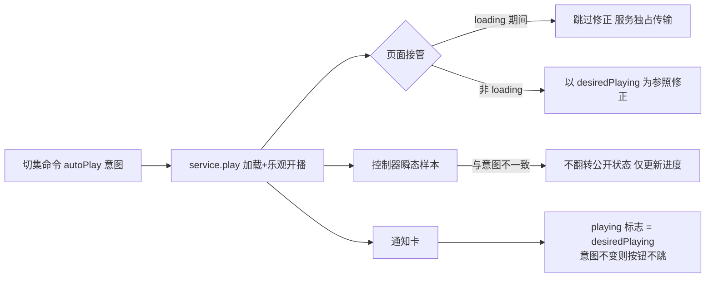

## 需求概述

修复两个严重缺陷，使「切换上下集自动播放」功能达到预期语义：

1. **切集后自动播放语义**：无论应用内按钮还是后台媒体通知卡片，切换上/下一集后，目标视频/音频**加载完成**，然后按「切换上下集后自动播放」开关决定——开：直接开始播放；关：停在记录点保持暂停。当前该开关在应用内"完全不起作用"。
2. **通知卡按钮状态稳定**：后台通知卡切集后，播放/暂停按钮必须与真实播放意图一致，不再乱跳。

## 排查结论（已确凿）

- **设置链路完全正常**（UI、字段、持久化 key、所有切集入口均正确读取 `autoPlayNextVideo`），问题不在设置。
- **确凿 Bug 1**：播放页接管服务控制器时的"状态修正"逻辑以瞬态 `service.isPlaying` 为参照（切集 loading 期间恒为 false），而控制器已乐观开播 → 页面误调 `playbackService.pause()` → `_setDesiredPlaying(false)` → 最终按暂停提交，autoPlay 意图被覆盖。共 3 处：video_player_screen.dart L2944-2953、L2832-2841、portrait_video_screen.dart L1230-1234。
- **确凿 Bug 2**：通知卡按钮状态由混杂信号驱动——`effectivePlaying` 仍参与瞬态 `isPlaying`；`ensureNotificationVisible` hack 先 forcePlaying 发布、80ms 后再正常发布，人为制造按钮翻转；`updatePlaybackStateFromController` 直接采信控制器瞬态样本翻转公开状态，不参照权威意图 `_session.desiredPlaying`。

## 技术方案

### 核心原则

`_session.desiredPlaying` 是播放/暂停的**唯一权威意图**（pause() 置 false、resume() 置 true、_commitControllerPlaybackIntent 按它提交）。所有"状态修正/同步/通知展示"必须以意图为准，瞬态控制器样本（isPlaying、迟到 clock）不得覆盖意图。

### 修改点

1. **页面接管修正（3 处）**：`video_player_screen.dart` L2944-2953（主路径）、L2832-2841（竖屏→横屏 handoff）、`portrait_video_screen.dart` L1230-1234：

- 服务 `state == loading` 时**完全跳过修正**（切集进行中服务独占传输，意图提交步骤自会对齐）；
- 其余情况以 `playbackService.desiredPlaying` 替代 `isPlaying` 作为参照。

2. **resume() 意图补全**：核实 paused 恢复分支（media_playback_service.dart L3918 之后）是否设置 `_setDesiredPlaying(true)`，若无则补上，保证任何恢复路径意图一致。

3. **updatePlaybackStateFromController 意图守卫**（media_playback_service.dart L4034 起）：当 `controller.value.isPlaying != _session.desiredPlaying` 时，不翻转公开 `_state`（避免 loading 提交前/后瞬态样本把状态打回暂停或播放），仅更新进度/时长/缓冲。页面切换按钮（video_player_screen L3504-3510、portrait L1482-1488）直接读控制器实际状态做决定，不依赖此翻转，不受影响。

4. **通知卡状态单一信号源**（system_media_session_service.dart）：

- `_buildPlaybackState` L614-617：`effectivePlaying = forcePlaying || snapshot.desiredPlaying`，移除瞬态 `isPlaying` 参与——意图不变则按钮不翻转；
- `ensureNotificationVisible` hack（L464-468）：两次发布使用同一 `_buildPlaybackState(snapshot)`（去掉 `forcePlaying: true`），消除人为按钮翻转，保留"确保通知可见"的用途。

### 约束

- 不破坏上一轮修复：后台就绪降级、媒体切换互斥锁、attach 失败 reopen 兜底、桌面端前台路径全部保持。
- 改动后运行 `flutter analyze` 与相关测试回归，更新 `test/notification_episode_switch_semantics_test.dart` 契约测试固化上述行为。