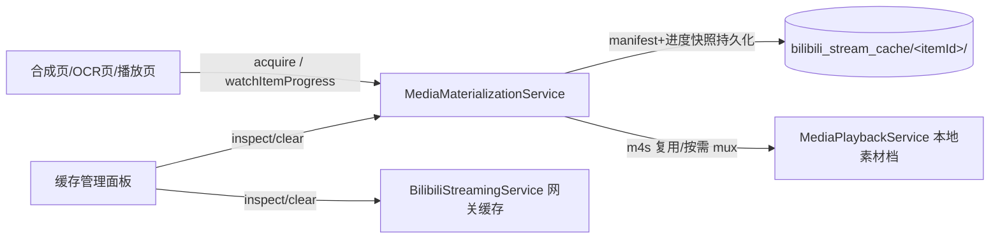

## 问题背景与根因（用户问题 1：OCR 页白屏）

用户在安卓手机上从竖屏播放页进入 OCR 面板 → 点全屏进横屏播放页 → 按返回键后，竖屏播放页整体变成白色错误画面。

经代码调查确认根因（Flutter 层没有任何白色背景 widget，白色来自 Android 上 Texture 挂载了失效纹理的空白帧 + 恢复序列被破坏）：

1. `portrait_video_screen.dart` 的 `_goToLandscape()` 是 `async void`，返回后的恢复序列（重挂 controller、隐藏 orientation bridge）中任一异常都会中断流程，导致 `_isOrientationTransitioning` 永久为 true，页面卡在黑色 bridge 分支且返回键被吞（该分支 PopScope 无回调）。
2. 恢复序列的同步分支直接 `_controller = playbackService.controller!`，缺少 `canMountControllerFor` / 视频输出有效性校验（`_initPlayer` 有），可能挂上无有效视频输出的 controller → Android Texture 渲染白帧。
3. 横屏页 pop 触发 `didPopNext` → `_onPlaybackServiceChange` 可能再次 `_initPlayer`，与 `_goToLandscape` 恢复续体形成双重初始化竞态；OCR Isolate 高负载会放大 `_waitForPlaybackViewport`（1200ms 超时）的竞态窗口，这正是 OCR 路径更容易触发的原因。
4. 其他页面（home → 横屏直入）无 orientation bridge 与双路径恢复，不存在此问题，无需修改。

## 需求（问题 2：B 站在线视频下载/缓存）

1. 合成页/OCR 页对在线视频的下载，退出页面再进入后进度条不应消失；OCR 抓帧预览的下载目前 dispose 即取消并删 .part，必须修复。
2. 建立统一缓存管理：按视频卡片聚合展示所有已下载文件（素材缓存 + 播放网关缓存），显示大小，支持查看与删除。
3. 播放复用：合成/OCR 已下载的 1080P 视频资源，在播放页播放同画质时应直接播本地文件，不再在线播放（等同播放缓存命中）。现有机制只认合成产出的完整 mp4，OCR 下载的 m4s 视频轨无法复用，需补齐。

## Tech Stack

- Flutter（Dart），Android/Windows 跨平台，media_kit 播放后端
- 修改集中在：`lib/screens/portrait_video_screen.dart`、`lib/services/media_materialization_service.dart`、`lib/services/ocr_subtitle_manager.dart`、`lib/widgets/ocr_subtitle_panel.dart`、`lib/services/media_playback_service.dart`、`lib/services/bilibili/bilibili_streaming_service.dart`、`lib/services/media_library_settings_sheet.dart` 相关

## Implementation Approach

### 问题 1 修复（白屏）

1. `_goToLandscape` 改为 `Future<void>` 并用 try/finally 保证 `_hideOrientationBridge()` 必然执行；bridge 分支的 PopScope 补上与正常分支一致的回调，保证任何时刻返回键可用。
2. 返回恢复序列的同步分支增加与 `_initPlayer` 相同的校验（`canMountControllerFor` / `_controllerHasRequiredVideoOutput`），校验失败或不满足时走 `_initPlayer()`（其内含 `needsVisibleVideoOutputRecovery` 视频输出恢复链路），避免挂上失效纹理。
3. 增加恢复互斥令牌（如 `_landscapeReturnToken`），使 `didPopNext → _onPlaybackServiceChange` 与 `_goToLandscape` 续体不会双重 `_initPlayer`；OCR 面板打开期间进入/退出全屏过渡时降低并发干扰。

### 问题 2 设计（统一缓存与下载管理）

- 复用现有 `MediaMaterializationService`（已具备持久化 manifest、跨功能复用、clearCard、租约机制），不新造缓存体系，只补齐缺失能力：

1. **全局下载任务注册表 + 进度快照**：在 MaterializationService 内维护 per-item 的活跃任务记录（requirement、targetHeight、stage、progress、字节数），内存 + 持久化快照（可挂在 materialization.json 同目录或独立 JSON），提供 `watchItemProgress(itemId)` 查询接口；页面重进时据此重新渲染进度条。
2. **OCR 抓帧下载移交 manager 级**：`ocr_subtitle_panel.dart` 的 `_preparationProgress` 页面级状态改为订阅 MaterializationService 的 item 进度快照，dispose 不再 complete 取消信号，仅解除监听；取消按钮保留。
3. **播放复用**：扩展 `acquireExistingPlayback` 的命中逻辑——当只有 OCR 下载的 `materialized_video_q{id}.m4s` 视频轨时，按需用已有 `_mux` 封装出播放 mp4（或直接以 m4s+音频轨播放），使播放页"本地素材"档位覆盖 OCR/转写已下载的画质。
4. **统一缓存管理 UI**：扩展 `media_library_settings_sheet.dart` 现有"Bilibili 在线播放缓存"区块，升级为按卡片列表展示（素材文件 + 网关 .cache 分类、大小、可单卡清除），底层复用 `inspectCache`/`inspectItemCache`/`clearCard`/`clearCacheForItemOnDisk`。

- 性能与可靠性：进度快照写入节流（复用 bilibili_download_state_manager 的 900ms 防抖模式）；下载仍为单 HttpClient 流式写盘，无新增热点；不改动现有租约/删除语义，保持向后兼容。

### 架构图

## Agent Extensions

### SubAgent

- **code-explorer**
- Purpose: 在实施各步骤前精读待改函数的完整上下文与调用点（_goToLandscape 全文、acquire/acquireExistingPlayback、OCR 面板 dispose 链），并在完成后验证修改未破坏既有调用方
- Expected outcome: 提供精确行号级修改依据与回归影响清单