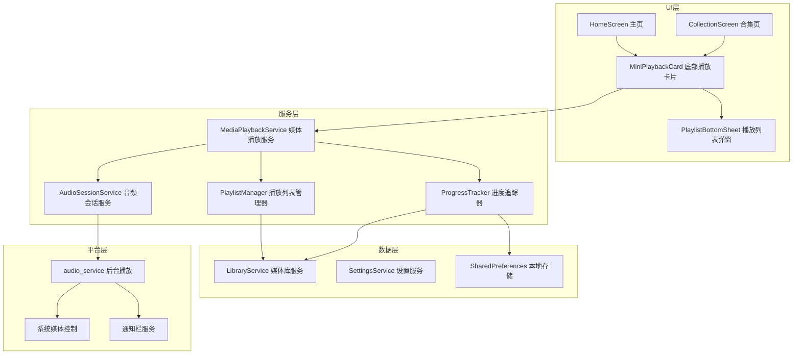
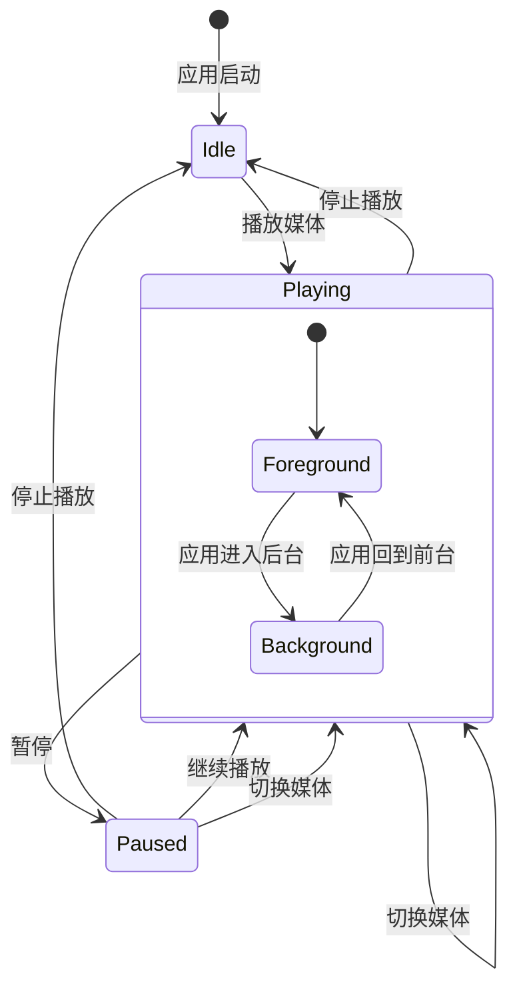

# 设计文档

## 概述

本设计文档描述了媒体播放列表与底部快捷播放卡片功能的技术实现方案。该功能将为视频播放器应用添加类似音乐应用的迷你播放器体验，支持后台播放、系统媒体控制集成和播放进度持久化。

## 架构

### 整体架构图



### 状态管理架构



## 组件和接口

### 1. MediaPlaybackService（媒体播放服务）

核心播放服务，管理全局播放状态和控制器。

```dart
/// 媒体播放服务 - 管理全局播放状态
class MediaPlaybackService extends ChangeNotifier {
  // 单例模式
  static final MediaPlaybackService _instance = MediaPlaybackService._internal();
  factory MediaPlaybackService() => _instance;
  
  // 播放状态
  PlaybackState get state;
  VideoItem? get currentItem;
  Duration get position;
  Duration get duration;
  bool get isPlaying;
  bool get isMuted;
  double get volume;
  
  // 播放控制
  Future<void> play(VideoItem item, {Duration? startPosition});
  Future<void> pause();
  Future<void> resume();
  Future<void> stop();
  Future<void> seekTo(Duration position);
  Future<void> setVolume(double volume);
  Future<void> toggleMute();
  
  // 播放列表控制
  Future<void> playNext();
  Future<void> playPrevious();
  
  // 播放器控制器访问（用于全屏播放页面）
  VideoPlayerController? get controller;
}

enum PlaybackState { idle, loading, playing, paused, error }
```

### 2. PlaylistManager（播放列表管理器）

管理当前播放队列和同文件夹媒体列表。

```dart
/// 播放列表管理器
class PlaylistManager extends ChangeNotifier {
  // 当前播放列表
  List<VideoItem> get playlist;
  int get currentIndex;
  VideoItem? get currentItem;
  
  // 列表操作
  void setPlaylist(List<VideoItem> items, {int startIndex = 0});
  void loadFolderPlaylist(String? folderId, String currentItemId);
  
  // 导航
  VideoItem? getNext();
  VideoItem? getPrevious();
  bool get hasNext;
  bool get hasPrevious;
  
  // 索引管理
  void setCurrentIndex(int index);
  int indexOfItem(String itemId);
}
```

### 3. ProgressTracker（进度追踪器）

负责播放进度的持久化存储。

```dart
/// 进度追踪器 - 管理播放进度持久化
class ProgressTracker {
  // 保存进度（防抖处理，最多每5秒保存一次）
  Future<void> saveProgress(String itemId, Duration position);
  
  // 立即保存（用于暂停、切换等场景）
  Future<void> saveProgressImmediately(String itemId, Duration position);
  
  // 获取保存的进度
  Duration? getProgress(String itemId);
  
  // 保存当前播放状态（用于应用恢复）
  Future<void> savePlaybackState(PlaybackStateSnapshot snapshot);
  
  // 恢复播放状态
  Future<PlaybackStateSnapshot?> restorePlaybackState();
}

class PlaybackStateSnapshot {
  final String? currentItemId;
  final Duration position;
  final bool wasPlaying;
  final String? playlistFolderId;
}
```

### 4. AudioSessionService（音频会话服务）

处理后台播放和系统媒体控制集成。

```dart
/// 音频会话服务 - 处理后台播放和系统控制
class AudioSessionService {
  // 初始化音频会话
  Future<void> init();
  
  // 更新媒体信息（用于通知栏显示）
  Future<void> updateMediaInfo(MediaInfo info);
  
  // 更新播放状态
  Future<void> updatePlaybackState(PlaybackState state, Duration position);
  
  // 媒体按键回调
  Stream<MediaAction> get mediaActions;
}

class MediaInfo {
  final String title;
  final String? artist;
  final String? album;
  final String? artworkPath;
  final Duration duration;
}

enum MediaAction { play, pause, stop, next, previous, seekTo }
```

### 5. MiniPlaybackCard（底部播放卡片组件）

底部迷你播放器UI组件。

```dart
/// 底部播放卡片组件
class MiniPlaybackCard extends StatefulWidget {
  // 动画控制
  final bool isVisible;
  final VoidCallback? onTap; // 点击卡片进入全屏播放
  
  // 响应式布局参数由内部计算
}

/// 响应式布局计算器
class PlaybackCardLayout {
  static PlaybackCardDimensions calculate(BuildContext context) {
    final screenWidth = MediaQuery.of(context).size.width;
    final isPhone = screenWidth < 600;
    final isTablet = screenWidth >= 600 && screenWidth < 1200;
    final isDesktop = screenWidth >= 1200;
    
    return PlaybackCardDimensions(
      height: isPhone ? 85.0 : (isTablet ? 95.0 : 75.0),
      thumbnailSize: isPhone ? 50.0 : (isTablet ? 60.0 : 50.0),
      titleFontSize: isPhone ? 14.0 : (isTablet ? 15.0 : 14.0),
      iconSize: isPhone ? 24.0 : (isTablet ? 28.0 : 24.0),
      padding: isPhone ? 12.0 : (isTablet ? 16.0 : 12.0),
    );
  }
}

class PlaybackCardDimensions {
  final double height;
  final double thumbnailSize;
  final double titleFontSize;
  final double iconSize;
  final double padding;
}
```

### 6. PlaylistBottomSheet（播放列表弹窗）

展示同文件夹媒体列表的底部弹窗。

```dart
/// 播放列表底部弹窗
class PlaylistBottomSheet extends StatelessWidget {
  final List<VideoItem> playlist;
  final String? currentItemId;
  final Function(VideoItem) onItemTap;
}
```

## 数据模型

### 播放状态快照

```dart
/// 播放状态快照 - 用于持久化和恢复
class PlaybackStateSnapshot {
  final String? currentItemId;
  final int positionMs;
  final bool wasPlaying;
  final String? playlistFolderId;
  final int timestamp;
  
  Map<String, dynamic> toJson();
  factory PlaybackStateSnapshot.fromJson(Map<String, dynamic> json);
}
```

### 扩展 VideoItem

现有的 `VideoItem` 模型已包含 `lastPositionMs` 字段，可直接用于进度存储。

## 正确性属性

*正确性属性是指在系统所有有效执行中都应保持为真的特征或行为——本质上是关于系统应该做什么的形式化陈述。属性作为人类可读规范和机器可验证正确性保证之间的桥梁。*

基于需求分析，以下是本功能的核心正确性属性：

### 属性 1：播放卡片显示条件一致性

*对于任意* 播放状态，当且仅当存在正在播放或暂停的媒体时，播放卡片才应显示。

**验证: 需求 1.3**

### 属性 2：响应式布局尺寸计算

*对于任意* 屏幕宽度，布局计算器应返回符合设备类型的正确尺寸：
- 手机（<600dp）：高度 80-90dp
- 平板（600-1200dp）：高度 90-100dp  
- 桌面（>=1200dp）：高度 70-80dp

**验证: 需求 2.1, 2.2, 2.3**

### 属性 3：播放列表文件夹过滤

*对于任意* 媒体项和其所在文件夹，播放列表管理器返回的列表应只包含该文件夹内的媒体项。

**验证: 需求 3.1**

### 属性 4：媒体切换位置恢复

*对于任意* 媒体项，当切换到该媒体时，播放服务应从该媒体记忆的播放位置开始播放。

**验证: 需求 3.3, 7.6**

### 属性 5：播放状态切换

*对于任意* 播放状态，点击播放/暂停按钮应切换到相反状态（播放→暂停，暂停→播放）。

**验证: 需求 4.1**

### 属性 6：播放列表导航边界

*对于任意* 播放列表和当前索引：
- 点击上一集：若当前不是第一项，则切换到上一项
- 点击下一集：若当前不是最后一项，则切换到下一项

**验证: 需求 4.2, 4.3**

### 属性 7：进度条同步

*对于任意* 播放位置变化，进度条显示的位置应与实际播放位置一致（误差不超过100ms）。

**验证: 需求 4.6**

### 属性 8：静音状态切换

*对于任意* 静音状态，点击静音按钮应切换到相反状态。

**验证: 需求 4.5**

### 属性 9：媒体控制命令响应

*对于任意* 系统媒体控制命令（播放、暂停、上一曲、下一曲），播放服务应正确响应并执行相应操作。

**验证: 需求 5.4, 6.1, 6.2, 6.3**

### 属性 10：进度保存往返一致性

*对于任意* 播放进度，保存后再读取应得到相同的值（往返属性）。

**验证: 需求 7.4**

### 属性 11：进度定期保存

*对于任意* 持续播放时间超过5秒的播放会话，进度追踪器应至少保存一次进度。

**验证: 需求 7.1**

### 属性 12：暂停时立即保存

*对于任意* 暂停操作，进度追踪器应立即保存当前位置。

**验证: 需求 7.2**

### 属性 13：切换时保存进度

*对于任意* 媒体切换操作，进度追踪器应在切换前保存当前媒体的播放位置。

**验证: 需求 7.3**

## 错误处理

### 播放错误

```dart
// 播放失败时的处理
try {
  await mediaPlaybackService.play(item);
} on PlaybackException catch (e) {
  switch (e.type) {
    case PlaybackErrorType.fileNotFound:
      // 显示文件不存在提示
      break;
    case PlaybackErrorType.codecNotSupported:
      // 显示编解码器不支持提示
      break;
    case PlaybackErrorType.networkError:
      // 显示网络错误提示
      break;
    default:
      // 显示通用错误提示
  }
}
```

### 进度保存错误

```dart
// 进度保存失败时静默处理，不影响用户体验
try {
  await progressTracker.saveProgress(itemId, position);
} catch (e) {
  debugPrint('进度保存失败: $e');
  // 不向用户显示错误，下次保存时重试
}
```

### 音频会话错误

```dart
// 音频会话初始化失败时降级处理
try {
  await audioSessionService.init();
} catch (e) {
  debugPrint('音频会话初始化失败: $e');
  // 降级：禁用后台播放和系统控制功能
  _backgroundPlaybackEnabled = false;
}
```

## 测试策略

### 单元测试

1. **PlaylistManager 测试**
   - 测试播放列表加载和过滤逻辑
   - 测试导航边界条件
   - 测试索引管理

2. **ProgressTracker 测试**
   - 测试进度保存和读取
   - 测试防抖逻辑
   - 测试状态快照序列化

3. **PlaybackCardLayout 测试**
   - 测试不同屏幕尺寸的布局计算

### 属性测试

使用 `glados` 库进行属性测试：

1. **属性 1 测试**：生成随机播放状态，验证卡片显示条件
2. **属性 2 测试**：生成随机屏幕宽度，验证布局计算结果
3. **属性 3 测试**：生成随机文件夹结构和媒体项，验证列表过滤
4. **属性 5 测试**：生成随机播放状态序列，验证状态切换
5. **属性 6 测试**：生成随机播放列表和索引，验证导航边界
6. **属性 10 测试**：生成随机进度值，验证保存/读取往返一致性

### Widget 测试

1. **MiniPlaybackCard 测试**
   - 测试组件渲染
   - 测试动画触发
   - 测试用户交互

2. **PlaylistBottomSheet 测试**
   - 测试列表渲染
   - 测试当前项高亮
   - 测试项目点击

### 集成测试

1. **播放流程测试**
   - 从媒体库选择媒体 → 播放 → 返回主页 → 验证播放卡片显示
   - 通过播放卡片控制 → 验证播放状态变化

2. **进度持久化测试**
   - 播放媒体 → 暂停 → 重启应用 → 验证进度恢复

