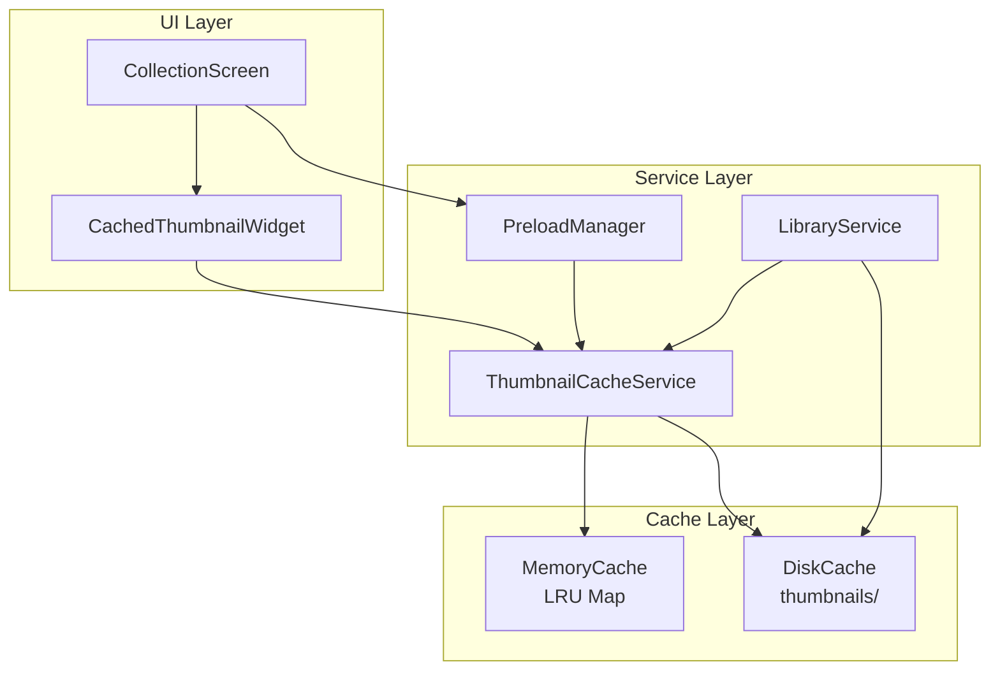

# Design Document: Thumbnail Loading Optimization

## Overview

本设计实现一个高效的缩略图缓存和加载系统，解决视频文件夹中大量视频缩略图加载卡顿的问题。核心策略包括：

1. **多级缓存架构**: 内存LRU缓存 + 磁盘缓存，减少I/O操作
2. **智能预加载**: 基于滚动位置预测并预加载即将显示的缩略图
3. **异步解码**: 使用Flutter的`ResizeImage`和缓存机制避免主线程阻塞
4. **生命周期管理**: 确保缓存与视频数据同步清理

## Architecture



## Components and Interfaces

### 1. ThumbnailCacheService

单例服务，管理缩略图的缓存和加载。

```dart
class ThumbnailCacheService {
  static final ThumbnailCacheService _instance = ThumbnailCacheService._internal();
  factory ThumbnailCacheService() => _instance;
  
  // LRU Memory Cache: videoId -> ImageProvider
  final LinkedHashMap<String, ImageProvider> _memoryCache;
  final int _maxCacheSize; // Default: 100 items
  
  // Get thumbnail with caching
  Future<ImageProvider?> getThumbnail(String videoId, String? thumbnailPath);
  
  // Preload thumbnail into memory cache
  Future<void> preloadThumbnail(String videoId, String? thumbnailPath);
  
  // Remove from cache (called when video deleted)
  void evictFromCache(String videoId);
  
  // Clear all memory cache
  void clearMemoryCache();
  
  // Check if thumbnail is in memory cache
  bool isInMemoryCache(String videoId);
}
```

### 2. ThumbnailPreloadManager

管理缩略图预加载策略。

```dart
class ThumbnailPreloadManager {
  final ThumbnailCacheService _cacheService;
  
  // Current preload queue
  final Queue<PreloadTask> _preloadQueue;
  
  // Active preload operations
  int _activePreloads = 0;
  static const int _maxConcurrentPreloads = 4;
  
  // Preload thumbnails for a range of items
  void preloadRange(List<VideoItem> items, int startIndex, int endIndex);
  
  // Cancel all pending preloads
  void cancelAll();
  
  // Update preload priorities based on scroll position
  void updatePriorities(int currentIndex, ScrollDirection direction);
}
```

### 3. CachedThumbnailWidget

优化的缩略图显示组件。

```dart
class CachedThumbnailWidget extends StatefulWidget {
  final String videoId;
  final String? thumbnailPath;
  final BoxFit fit;
  final Widget? placeholder;
  final Widget? errorWidget;
  
  // Build method returns:
  // - Placeholder while loading
  // - Fade-in image when loaded
  // - Error widget on failure
}
```

### 4. LibraryService 扩展

在现有LibraryService中添加缓存清理逻辑。

```dart
// 在 _deleteVideoFiles 方法中添加:
Future<void> _deleteVideoFiles(VideoItem vid) async {
  // ... existing code ...
  
  // NEW: Evict from memory cache
  ThumbnailCacheService().evictFromCache(vid.id);
}
```

## Data Models

### PreloadTask

```dart
class PreloadTask {
  final String videoId;
  final String? thumbnailPath;
  final int priority; // Lower = higher priority
  final DateTime createdAt;
  bool isCancelled;
}
```

### CacheEntry (Internal)

```dart
class _CacheEntry {
  final ImageProvider provider;
  final DateTime lastAccessed;
  final int sizeBytes; // Estimated memory size
}
```

## Correctness Properties

*A property is a characteristic or behavior that should hold true across all valid executions of a system-essentially, a formal statement about what the system should do. Properties serve as the bridge between human-readable specifications and machine-verifiable correctness guarantees.*

### Property 1: Memory Cache LRU Eviction

*For any* sequence of thumbnail accesses, when the memory cache exceeds its maximum size, the least recently used entry shall be evicted first.

**Validates: Requirements 1.1, 1.3, 1.5**

### Property 2: Cache Hit Returns Same Provider

*For any* video ID with a cached thumbnail, consecutive calls to `getThumbnail` shall return equivalent ImageProvider instances without disk I/O.

**Validates: Requirements 1.2**

### Property 3: Eviction Removes Entry Completely

*For any* video ID, after calling `evictFromCache`, the `isInMemoryCache` method shall return false for that ID.

**Validates: Requirements 4.2, 4.5**

### Property 4: Preload Respects Concurrency Limit

*For any* number of preload requests, the number of concurrent active preload operations shall never exceed the configured maximum.

**Validates: Requirements 2.5**

### Property 5: Thumbnail Deletion Synchronization

*For any* video permanently deleted from the recycle bin, both its disk thumbnail file and memory cache entry shall be removed.

**Validates: Requirements 4.1, 4.2, 4.3**

## Error Handling

| Error Scenario | Handling Strategy |
|----------------|-------------------|
| Thumbnail file missing | Return null, display fallback icon, log warning |
| Memory allocation failure | Reduce cache size, evict entries, retry |
| Disk I/O error | Return null, display fallback, don't cache |
| Invalid image format | Return null, display fallback, remove corrupt file |
| Preload cancelled | Silently skip, no error propagation |

## Testing Strategy

### Unit Tests

1. **LRU Cache Behavior**
   - Test eviction order when cache is full
   - Test access updates LRU position
   - Test cache size limits

2. **Cache Operations**
   - Test getThumbnail returns cached value
   - Test evictFromCache removes entry
   - Test clearMemoryCache empties cache

3. **Preload Manager**
   - Test concurrent preload limiting
   - Test priority updates
   - Test cancellation

### Property-Based Tests

使用 `dart_check` 或 `glados` 库进行属性测试：

1. **Property 1**: 生成随机访问序列，验证LRU驱逐顺序
2. **Property 3**: 生成随机缓存状态，验证evict后isInMemoryCache返回false
3. **Property 4**: 生成大量并发预加载请求，验证并发数不超过限制
4. **Property 5**: 模拟删除操作，验证缓存同步清理

### Integration Tests

1. 测试CollectionScreen滚动时缩略图加载流畅性
2. 测试从回收站删除视频后缓存清理
3. 测试大量视频文件夹的性能表现
