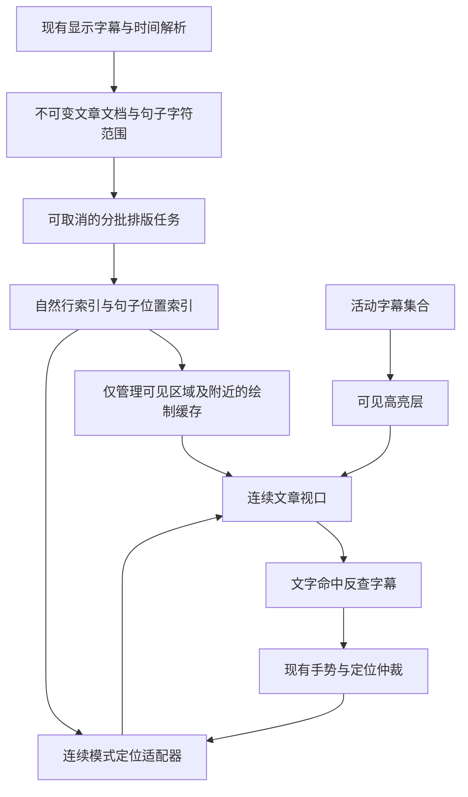

# Subtitle Sidebar 连续文章模式改进计划

日期：2026-09-17  
状态：设计与验收计划；尚未实现功能，尚无本功能的性能测试结果。  
检查基线：仓库 HEAD `08e54250` 及当前工作区中的字幕侧栏修改。实施前必须重新记录实际基线，保留已有未提交工作。

## 1. 目标与交付原则

在字幕侧栏的文章视图设置中增加“段落模式”开关：默认开启，每段默认 4 句；关闭后，全部字幕按顺序自然接续，成为可以连续阅读的一整篇文章。连续模式的定位、高亮和点击必须使用每句话自己的实际文字位置。

技术判断：可实现，但必须把正文排版、可见内容绘制、高亮和滚动定位分离。不能把现有段落大小改成字幕总数，也不能用去掉段间距代替真正的连续排版。

“绝对没有任何 bug、任何设备上绝不卡顿”无法由设计或有限测试证明。本计划将要求落实为：已知功能缺陷为零、可复现的新增卡顿为零、规定场景和设备上的性能门槛全部通过、真实播放和原生稳定性验证通过。没有证据的项目只能记为未验证，不能记为通过。

本次交付的对象是计划文档。后续实施必须先证明最困难的排版原型可行，再接入正式开关；不能先交付一个会卡顿的模式，再把性能修复留到以后。

## 2. 产品行为与设置契约

### 2.1 设置界面

仅在文章视图的设置区域显示以下内容，沿用现有字体、定位位置等设置的视觉样式和窄侧栏适配方式。

| 项目 | 行为 |
| --- | --- |
| 段落模式 | 新增布尔开关；开启为现有分段文章，关闭为连续文章 |
| 每段句子数 | 开关开启时可编辑；关闭时仍显示已保存的数值，但禁用输入和加减按钮 |
| 默认值 | 段落模式开启，每段 4 句 |
| 字体与定位位置 | 两种文章模式均可使用，继续保留横屏和竖屏各自的设置 |
| 列表/文章切换 | 保持现有两项，不新增第三个顶层视图按钮 |
| 说明文案 | 开关附近可用简短说明“关闭后连续显示全部字幕”；不向用户展示缓存、分块等实现细节 |

这里的“4”指每段包含 4 条字幕，与现有“每段句子数”一致，不是全文一共分成 4 段。单条字幕即本功能的句子单位，不重新按标点拆句。

建议固定测试标识：

- `subtitle-paragraph-mode-switch`
- 继续保留现有 `subtitle-sentences-per-paragraph-input` 及输入框、加减按钮标识。
- 连续视图使用独立标识 `subtitle-continuous-article-view`，不依赖段落组件数量验证它。

### 2.2 持久化与迁移

新增 `SettingsService.subtitleArticleParagraphModeEnabled`，类型 `bool`，默认 `true`。

保留 `subtitleArticleSentencesPerParagraph`：默认 `4`，有效范围继续为 `1..99`。连续模式不借用 `0`、`99` 或其他特殊数值表示，不覆写每段句子数。

| 场景 | 结果 |
| --- | --- |
| 全新安装 | 分段开启，每段 4 句；原有列表/文章默认选择不变 |
| 旧用户只有段落句数配置 | 新开关按开启处理，保留旧用户有效句数，不强制重置为 4 |
| 用户关闭开关后重启 | 恢复连续模式，原段落句数仍保留 |
| 用户再打开开关 | 恢复分段及之前保存的每段句数 |
| 新配置类型损坏或缺失 | 按现有设置系统的规范化机制安全回到默认值 |
| 设置导出、导入、重置 | 注册新设置并加入 `layout` 快照；走现有统一流程，验证往返一致性 |

新开关与现有每段句数一样，作为共享设置用于横屏、竖屏、视频和音频侧栏。已有但被路由覆盖的侧栏也要在恢复时拿到最新值，不能只在 `initState` 读取。

新开关独立于 `videoContinuousSubtitle` / `audioContinuousSubtitle`：后两者控制字幕在时间轴间隙中的延续，不控制文章排版，不能混用。

### 2.3 阅读与播放行为

- 句子按当前显示轨道和过滤选项的顺序接续，不按内部缓存批次强制换行。
- 保持现有文章文本处理规则：字幕内部换行转换为空格、去掉首尾空白；句间连接符先沿用现有两个空格，避免附带修改标点和中英文间距规则。
- 保持现有字号、正常字重、行高、左右边距、颜色及高亮风格；高亮不改变字重或其他影响几何的属性。
- 保留“全部 / 第一行 / 第二行”、双字幕轨道匹配、字幕同步偏移和图片字幕占位逻辑。
- 无显示文字的字幕仍保留时间和身份，但不生成虚假的文字位置；定位它时明确使用相邻可显示字幕作为阅读锚点，高亮不伪装为相邻字幕。
- 自动跟随开启且用户没有拖动时，切换排版后对齐当前播放句。
- 自动跟随关闭或用户正在阅读别处时，切换排版优先保留阅读锚点，不擅自 seek 或滚回当前播放句。
- 连续模式必须按句定位。分段模式保留当前布局和交互；对旧路径的适配不得顺带改变其定位策略。

## 3. 当前实现的依据与问题

实施时按符号查找，避免依赖会随改动变化的行号。

| 当前位置 | 已确认的行为 | 对方案的影响 |
| --- | --- | --- |
| `lib/widgets/subtitle_sidebar.dart` → `_buildArticleView` | `ScrollablePositionedList.builder` 按段落创建 `SubtitleArticleChunk` | 段落是当前的加载、绘制和滚动单位 |
| 同文件 → `_scrollToIndex`、`_jumpToActiveIndexWithAlignment` | 使用 `index ~/ _articleChunkSize` 定位段落 | 连续模式必须提供自己的句子几何，不能沿用该换算 |
| 同文件 → `_SubtitleArticleChunkState.build` | 高亮变化时重建该段所有 span | 把全文塞进一段会把更新成本扩大到全文 |
| 同文件 → `_shouldTopAlignArticle` | 逐段测量，超过视口便停止 | 连续模式不能把全文作为一段交给这条预测量路径 |
| 同文件 → `subtitleIndexAtGlobalPosition` | 已能把段内落点反查成字幕编号 | 可复用交互语义，但新视图需要自己的命中实现 |
| 同文件 → `_locateRequestId` 等 | 已处理自动跟随、显式定位、路由恢复的竞争 | 新引擎必须服从已有定位仲裁，不能并行启动另一套自动滚动 |
| `lib/services/settings_service.dart` | 段落句数已注册且可导出 | 新开关必须接入同一机制 |
| `lib/services/subtitle_timeline_resolver.dart` | 已支持活动字幕、重叠时间段和偏移后的查询 | 沿用，不重写播放时间判定 |

当前本机 `TextPainter.paint` 的实现中，即使只改变绘制样式，底层段落也可能被重新创建并再次布局。因此只保证字号不变，或只增加 `RepaintBoundary`，都不足以消除巨型富文本的更新成本。官方实现也显示了这条路径：[TextPainter.paint](https://api.flutter.dev/flutter/painting/TextPainter/paint.html)。

仓库的 [原生播放回归记录](desktop-render-performance.md) 已说明：组件测试和 Release 构建成功不能证明实际播放稳定。新方案不改变播放器纹理尺寸、原生视频输出或 `VideoController.setSize` 策略。

## 4. 总体架构

采用“文档数据 + 增量排版索引 + 有界绘制缓存 + 单一定位入口”的结构。



新逻辑放在独立的 `lib/features/subtitle_article/` 模块。`subtitle_sidebar.dart` 负责设置入口、显示模式选择、现有时间和手势语义的接线，不再承担全文排版算法。

连续模式拟采用基于 Flutter `Scrollable` / `Viewport` 的专用视口与自定义 sliver/render object，使绘制对象按可见区域创建和回收。确切实现必须由原型验证，但不能退回一个包住全文的 `SingleChildScrollView + RichText`。

使用一个连续模式滚动位置；不使用第二份全文列表做交叉淡入，也不让多个控制器同时修改同一视图的落点。

## 5. 文档模型与索引

### 5.1 数据结构

建议引入以下内部类型；名称可按代码规范调整，职责不得混淆。

| 类型 | 最小内容 |
| --- | --- |
| `ArticleDocument` | 文档代次、显示文字片段、累计 UTF-16 长度、句子身份与文字范围 |
| `ArticleSentenceRef` | 文档代次、来源轨道、来源位置、当前显示索引；不假设 SRT 编号唯一 |
| `ArticleLayoutKey` | 文档版本、实际内容宽度、字体及回退字体版本、字号、行高、字距、词距、`TextScaler`、locale、方向、strut 等布局参数 |
| `ArticleLineRecord` | 逻辑字符范围、自然行号、基线、顶部、底部、所属排版记录 |
| `ArticleSentenceGeometry` | 句子首个可见字符对应的行/坐标；需要时取得覆盖的多个文字区域 |
| `ArticleLayoutCheckpoint` | 已完成的精确文字边界、行号、累计高度和恢复布局所需上下文 |
| `ArticleReadingAnchor` | 句子身份、句内字符偏移、该字符相对视口的位置 |
| `ArticleLocateRequest` | 请求号、文档代次、布局代次、目标身份、来源、动画方式 |

文字范围在规范化后的显示文本上计算，不使用原始 SRT 文本的字符偏移。连接空格也参与累计偏移，但不归属某一句可点击文字。

使用 Flutter 接口要求的 UTF-16 offset；遍历或截取时遵守 Unicode 字素边界，不能从代理对、组合字符或 emoji 序列中间切开。若直接使用 `characters`，应将它声明为直接依赖，而不是依赖其他包间接带入。

同一字幕条目可能包含主副两种文字：对其可见部分都保留来源映射。只显示副轨时，应沿用现有显示轨道的时间与点击映射，不能把副轨索引当作主轨索引。

### 5.2 存储和复杂度约束

- 原始显示文字和轻量索引允许随全文长度增长，这是精确文档必须付出的存储成本。
- 不能为全文每个字符分配矩形对象、Widget、GlobalKey 或手势识别器。
- 保留每句的范围和锚点、每行的紧凑索引；逐字/逐词的命中与高亮几何仅为当前可见内容建立。
- `句子 → 字符范围` 使用直接索引；`字符位置 → 句子` 和 `滚动位置 → 行` 使用有序索引查询。
- 排版大对象、图层、图片和绘制记录使用有界缓存，不随看过的全文长度无限累积。
- 文字模型以片段和前缀长度管理，不在每批排版时重新拼接全部已处理前缀。

## 6. 连续排版算法：先证明，再接入

### 6.1 基本过程

1. 从文档开头，或同一 `ArticleLayoutKey` 下已验证的检查点开始。
2. 读取有界文字窗口，包含必要的前后文，不把每条字幕当作一个不可拆开的块。
3. 使用 Flutter 的真实字体排版获取换行和文字几何，禁止用“平均字宽 × 字符数”决定断行。
4. 只提交边界已经确定的完整自然行；窗口末尾可能继续接字的行留待后续窗口一起排版。
5. 保存已提交行的范围、几何和恢复信息。下一批从这些自然行之后继续，不能在句子边界人为另起一行。
6. 把自然行组织成有限高度的绘制单元；句子允许跨行，也允许跨绘制单元。
7. 文档末尾确认后提交最后一行，产生精确总高度。

`TextPainter.getLineBoundary` 可以取得已经排版的行的文字范围，但它不是一个现成的增量排版引擎，也不会替项目完成上下文续接。[接口说明](https://api.flutter.dev/flutter/painting/TextPainter/getLineBoundary.html)

### 6.2 不允许跳过的正确性问题

“把最后一行留下”只是基本策略，不能据此声称所有语言都正确：双向文字、连字、字体塑形、标点禁则和超长词可能依赖更长上下文。Flutter 公共接口也不直接提供可序列化的内部塑形状态。

因此在正式开发前设置排版原型门槛：

- 建立仅用于测试的完整单段 `TextPainter` 参考实现，以同一文本和布局参数对照。
- 对中英文混排、阿拉伯文/希伯来文及数字混排、印度文字、泰文、emoji、组合音标和长词验证行范围、字形、句子锚点和批次边界。
- 改变内部窗口大小和缓存淘汰顺序，结果必须保持一致；内部批次大小不能成为影响用户排版的隐藏设置。
- 必须证明检查点重建不会丢失上下文；必要的方向/断词预处理属于纯文本层，不能假定新建 `TextPainter` 会自动继承前一批的状态。
- 若有限上下文的 Flutter 窗口方案无法保证目标文字集正确，先修正排版后端设计，评估具有增量布局能力的成熟实现及其跨平台成本；不能通过忽略这些文字、偷偷插入换行或恢复巨型全文控件过关。

该原型仍有工程验证工作，不把它包装成已经证实的现成功能。若原型未过关，停在该阶段继续解决，正式设置入口不发布。

### 6.3 首次打开与远距离定位

精确换行具有前文依赖。没有同宽度的有效检查点时，不能声称能从任意字幕编号直接得到精确行号。

- 从开头阅读时，优先形成首屏和预取区，再逐步完善后续索引。
- 恢复到文档后部时，使用最近的有效检查点向目标推进；没有检查点时，必须分批计算必要前缀。
- 冷定位期间保留上一份有效画面并显示轻量准备状态；不先跳到估算位置、随后来回修正。
- 新布局达到目标并覆盖目标视口及预取区后，原子提交画面和滚动落点。
- 首次进入且没有旧画面时可以短暂显示“正在准备文章”，但不能把空白画面或永久加载当作完成。
- 预先完成排版的工作仅在文章模式相关且视口尺寸已知时按预算运行，不能让从未启用连续模式的默认用户持续承担后台成本。

正文未全部排完时，总高度可以有临时估计，但必须与精确局部坐标分开管理。估计只辅助滚动范围/预取，不能用于最终句子定位。新增精确高度时保持当前阅读锚点，不允许可见文字跳动。

如果原型依靠限制滚动速度、频繁加载占位或长时间阻止用户定位才能避免掉帧，同样判为性能方案失败。

## 7. 调度、缓存与资源管理

### 7.1 主线程预算

- 文本规范化、范围索引等纯 Dart 工作在有必要时放到后台 isolate，或按预算处理；后台消息携带文档代次。
- 不把 `TextPainter`、`ui.Paragraph` 或其他 `dart:ui` 排版工作直接交给普通后台 isolate。Flutter 官方明确说明此限制。[Isolate 限制](https://docs.flutter.dev/perf/isolates)
- UI 排版任务按帧预算分批，优先顺序为：当前可见内容、最新显式定位、运动方向预取、其余索引。
- 初始预算目标：60 Hz 下每帧新增排版工作不超过 2 ms；120 Hz 下不超过 1 ms。预算需为当前播放器和动画留下余量，不是整帧预算。
- 避免使用连续 microtask 或无限 `Future` 链阻止帧调度。单批完成后通过明确调度点归还事件循环。
- 帧内预算不能中断已经开始的原生 `layout()`。必须记录单次调用耗时并自适应限制输入规模；一个同步调用超时后再检查计时器，并不能补救已发生的卡顿。
- 初始实验窗口为 512～4096 个 UTF-16 单元，包含上下文；最终大小由最弱目标设备的测量和正确性要求共同确定，不直接写死“每 50 句”。

超长单条字幕、无空格长串、复杂组合字符必须进入压力测试。不能假定单条字幕很短，也不能为满足窗口上限切断字素。无法在预算内处理的极端上下文要作为后端阻塞问题记录，禁止静默删字、截断或换成图片。

### 7.2 缓存策略

| 缓存 | 策略 |
| --- | --- |
| 文档与范围索引 | 按文档代次保留，内容变化时替换；不受播放高亮影响 |
| 行索引与检查点 | 与完整布局 key 绑定；以紧凑结构保存精确位置 |
| 原生段落/绘制记录 | 可见区必须驻留；初始前后各预取约 1 个视口，根据速度调整，受总预算约束 |
| 文字命中矩形 | 只为可见及邻近内容生成，离开缓存区后释放 |
| 横竖屏布局 | 最多保留最近使用的两个版本，但共享统一内存上限；不足时优先释放非当前布局 |
| 正在替换的旧画面 | 最多一份；提交新版本后释放，不把每次宽度变化都加入历史缓存 |

重缓存初始目标上限：移动设备 16 MiB，桌面 32 MiB；这是排版和绘制缓存预算，不包含原始字幕、轻量索引及视频纹理。原生对象实际占用不能只靠 Dart 对象大小推断，需结合进程和 native heap 测量。

可见内容的正确性优先，不能为了名义缓存上限释放正在绘制的资源。若正常视口就超出预算，应修改绘制单元和缓存结构，而不是偷偷扩大到全文。

失效、淘汰或销毁时，显式释放 `TextPainter` / `Paragraph` / `Picture` 等拥有的原生资源；引用仍用于当前帧时不得提前释放。

## 8. 绘制、高亮与输入

### 8.1 绘制正文

只把可见区及有限预取区交给绘制缓存。滚动时复用排版结果，不重新做全文字符串拼接、句子遍历或断行。

不能仅使用 `ClipRect` 裁掉巨型全文，然后声称已经虚拟化：裁剪只限定可见输出，不能自动消除全文构建、塑形及原生对象管理成本。

### 8.2 高亮不驱动正文重新布局

首选实现：每个有界绘制单元缓存同几何的普通文字和强调色文字绘制结果，高亮背景单独画；根据活动句的实际文字区域选择相应绘制内容。普通和强调版本必须有相同断行与字形位置，避免整篇修改 `TextSpan.style`。

实现时特别验证：

- 裁剪范围覆盖真实字形，不切掉斜体边缘、音标和组合字符。
- 普通与强调层没有抗锯齿叠加造成的重影或颜色边缘。
- 同一行有多个句子时，高亮只覆盖目标句，连接空格和旁边句子不误亮。
- 一句话跨多行或多个绘制单元时，所有可见片段都同步高亮。
- 时间段重叠时支持多个活动句；更新可见范围内旧集合和新集合的差异。
- 播放位置变化但活动集合没变时，文章正文新增 layout、正文 build 和无效滚动动画均为零。

具体采用裁剪复用还是其他局部绘制方式，以原型的几何、视觉和 raster 成本共同判断；不能为了避免 layout 引入更昂贵的大面积 `saveLayer`。

### 8.3 点击和手势

命中流程：视口坐标 → 文档局部行 → 可见排版对象的文字位置 → 句子范围索引 → 现有点击处理入口。

`getPositionForOffset` 返回邻近文字位置，不等于真的点中文字；必须再校验真实文字命中区域，防止行末空白、连接空格和上下边距误触。[TextPainter 接口](https://api.flutter.dev/flutter/painting/TextPainter-class.html)

- 不给每个字母、词或全文每句话创建永久手势识别器。
- 继续复用当前指针会话、单击确认、拖动判定、拖动期间副指针双击及 seek 完成逻辑。
- 保留原有“拖动期间双击只 seek，所有手指抬起后再按规则定位”的语义。
- 自动跟随关闭时，点击 seek 不强制滚动；显式定位按钮仍有效。
- 长按、滚动惯性和鼠标滚轮不被误判为单击。
- 提供可见文字及动作的语义节点，验证屏幕阅读器不会把整篇复制成多个重复节点；不顺带增加现有文章视图未提供的全文选字功能。

## 9. 按句定位与请求仲裁

### 9.1 几何定义

句子定位锚点定义为：该句第一个可见文字所在行的顶部。长句仍按首行定位，高亮覆盖整句；不使用句子全部矩形的总高度中心，也不使用所在绘制单元顶部。

Flutter 可以按文字范围返回多个矩形，适用于跨行和双向文本；逻辑连续文字不一定对应单个矩形。[getBoxesForSelection](https://api.flutter.dev/flutter/painting/TextPainter/getBoxesForSelection.html)

令 `sentenceY` 为真实句子锚点在文章中的纵坐标，`viewportH` 为内容视口高度，`p` 为定位比例，则基本目标为：

```text
targetOffset = clamp(sentenceY - desiredViewportY, minExtent, maxExtent)
desiredViewportY = p × viewportH
```

实际处理：

- 定位比例接近 100% 时保证目标首行可见，不把整行放到裁剪区域之外。
- 文首、文尾以可达滚动边界为准；不足一屏的文章顶部对齐。
- 同一自然行内的两句话纵坐标相同，切换时可以不滚动；高亮必须正确变化。
- 对已在目标位置的句子不启动无效动画。
- 几何比对误差目标不超过 1 个逻辑像素；边界场景按夹取后的目标验证。

### 9.2 适配现有侧栏

先给现有侧栏增加内部视图适配层，表达“是否有可用几何、命中、按句定位、定位首句、读取/恢复阅读锚点、取消动画”。旧列表/分段模式通过现有控制器实现等价适配，连续模式提供自己的实现。

必须覆盖目前依赖 `_isArticleMode` 二选一的所有入口，至少包括：

- `_currentItemPositions` / `_hasLocateGeometry` 对应的几何可用性判断。
- `_scrollToIndex`、`_jumpToActiveIndexWithAlignment`、`_jumpToIndexTopInternal`。
- `_resolveRowIndexAt`。
- `_resolveReachableAlignment` / `_shouldSkipScrollAnimation` 对应的边界和重复定位判断。
- 路由恢复、视口尺寸变化、显示轨道切换和初次字幕载入后的修复路径。

不能伪造一个 `ItemPosition` 代表全文，让已有逻辑误以为得到了句子位置。

### 9.3 状态与竞争规则

定位过程使用明确状态：`待几何 → 待排版 → 可提交 → 滚动中 → 已验证`；任何阶段均可被取消或被更新请求替代。

每次异步提交同时验证：

```text
mounted
当前媒体 / 文档代次匹配
当前布局代次匹配
当前定位请求号匹配
侧栏可见、路由在前台、视口可用
当前手势会话允许该请求执行
```

规则沿用当前实现：显式操作接管时取消已有自动跟随；路由修复等待真正布局；不能让旧 seek 回调或隐藏页积压动画拉回旧位置。新请求在同一仲裁入口产生，不能只加一个独立 timer。

内容换源、过滤选项改变、字号/宽度改变、切换模式、关闭/销毁、用户打断动画，都必须有明确取消路径。暂停播放时补帧继续使用 `ensureVisualUpdate` 等现有策略，不依赖未来的播放 tick 恰好唤醒。

视口高度接近零或页面被覆盖时挂起工作，不每帧空转重试。恢复时只执行最新仍有效请求。

## 10. 失效、重排与阅读位置保持

| 变化 | 应执行的工作 | 不应执行的工作 |
| --- | --- | --- |
| 活动字幕集合改变 | 更新可见高亮，按规则定位 | 重建全文或重排正文 |
| 播放 tick，活动集合未变 | 沿用现有时间解析结果 | 新建高亮对象树、滚动动画 |
| 字幕同步偏移 | 重新算活动句和目标时间映射 | 因时间变化清空文字排版 |
| 字幕文字或显示轨道改变 | 更新文档代次、范围、索引；旧任务失效 | 复用旧文档的句子 offset |
| 字体/字号/宽度/系统文字缩放改变 | 新布局代次，按新参数重排 | 使用旧坐标作为最终落点 |
| 仅视口高度改变 | 更新可见区和定位比例 | 宽度未变时重新断行 |
| 仅文字颜色改变 | 失效绘制缓存，复用有效几何 | 扫描并重新生成所有行位置 |
| 隐藏侧栏或路由覆盖 | 停止预取和动画，保留受预算限制的有效数据 | 隐藏期间排完整篇 |
| 当前媒体替换 | 作废旧文档任务和锚点，回收资源 | 应用旧媒体的延迟回调 |

重排前保存“句子身份 + 句内字符位置 + 视口相对位置”，不保存一个旧像素滚动值来冒充阅读锚点。

快速拖动侧栏宽度或字号滑块时合并过时任务：最多一个当前布局任务和一个最新待处理目标；不为每个中间值排完整篇。保留上一份有效绘制结果作为短暂过渡，并明确它属于旧布局代次；触摸命中也使用同一可见版本。最新布局就绪后原子切换，不能用新索引去命中旧画面。

只要不是用户明确定位到播放句，就优先保持阅读锚点。锚点内容已被删除时，按稳定的相邻字幕规则恢复，并有测试说明。

## 11. 性能验收门槛

以下为需要达成的目标，不是当前实测结果。实施阶段先记录旧模式基线，再测试连续模式。不得为让报告通过而事后删除失败素材、排除慢设备或悄悄放宽门槛。

### 11.1 设备与采样条件

- 覆盖实际支持并交付的平台。至少包括本项目的 Windows 桌面、Android 和 iOS 实机；macOS/Linux 若继续交付，也需要各自验证，不能用 Windows 结果代替。
- 各平台记录设备型号、CPU/GPU、内存、系统、刷新率、DPR、Flutter/engine 版本和构建方式；移动端至少覆盖一台产品计划支持的较弱设备。
- 以 Profile 模式做归因测量，以正式 Release 业务页做体验、稳定性和长时间测试；Debug 帧时不能当性能结论。
- 覆盖 60 Hz；产品在 120 Hz 设备运行时还要验证 120 Hz。只通过 60 Hz 不表述为 120 Hz 流畅。
- 分开报告纯文字侧栏和真实视频同时播放；包括关闭侧栏、现有分段开启、连续模式三份对照。
- 每个稳定滚动/跟随场景至少采集 2 分钟，至少 3 次独立运行；冷启动单独测，不混进预热平均值。

Flutter 的 Performance View 用于定位 UI、raster 和 timeline 耗时；最终以真机记录为依据。[性能工具说明](https://docs.flutter.dev/tools/devtools/performance)

### 11.2 数据规模

| 数据集 | 规模 | 目的 |
| --- | --- | --- |
| S | 0、1、2、4、5、99 条及不足一屏 | 边界、默认值、短文对齐 |
| M | 1,000 条，约 5 万 UTF-16 单元 | 一般长视频 |
| L | 5,000 条，约 25 万 UTF-16 单元 | 用户已指出的句子多场景 |
| XL | 20,000 条，约 100 万 UTF-16 单元 | 长文性能主压力集 |
| E | 100,000 条 / 约 500 万单元，以及 10 万单元的单条字幕 | 资源边界、取消、超长句和增长趋势 |

规模按“条数 + 实际文字量”同时记录。所有主数据集包含自然长短句、重复文字和跨行句，不能仅用固定短字符串证明性能。另设多语言、极窄视口、最大字号、重叠时间段和高频切句压力集。

### 11.3 量化指标

| 指标 | 目标 |
| --- | --- |
| 高亮切换的正文 layout 次数 | 已缓存且布局参数不变时为 0 |
| 无活动句变化的 tick | 文章正文新增 layout/build、无效滚动次数为 0 |
| 全文扫描 | 稳态滚动、高亮和已缓存定位路径为 0；不包括首次建索引和必要重排 |
| UI 与 raster 耗时 | 两者分别 P99 不超过设备帧预算：60 Hz 为 16.67 ms，120 Hz 为 8.33 ms |
| 呈现层丢帧 | 用平台/引擎可用的实际呈现证据单独记录，不能仅凭 UI/raster 各自达标推出无丢帧；新增模式引起的可复现连续掉帧必须修复 |
| 超长停顿 | 测试场景中，归因于连续文章的超过 50 ms UI 主线程阻塞为 0；短于 50 ms 仍须满足帧预算要求 |
| 热缓存点击和定位反馈 | 两个显示帧内可见响应；滚动动画完成时间另计 |
| M/L/XL 冷首屏与冷远处目标准备 | 目标分别不超过 300 / 800 / 2,000 ms；必须包含规范化、索引、必要前缀排版和提交，不能仅计算 paint |
| 几何稳定 | 停止交互后最终句子定位误差 ≤ 1 逻辑像素；后台补全索引不导致可见锚点跳动 |
| 宽度/字号连续拖动 | 输入持续有响应，不积压中间版本；停止后按对应规模的冷布局目标完成最新精确布局 |
| 内存 | 重缓存受预算约束；索引随数据量合理线性增长；反复进入/退出不发生持续增长 |
| 隐藏后的排版 | 没有新布局和预取空转；已有同步调用返回后停止继续提交 |

E 集的首屏/远处耗时单独报告，不伪装为主数据集成绩；必须仍满足正确性、有限资源、可取消和不长时间阻塞 UI 的要求。若普通有效内容落入明确无法满足的边界，作为未解决限制记录，不能宣称“所有长度绝不卡顿”。

缓存命中的已布局区域，稳态工作量应主要取决于可见行数和活动文字范围，而不是全文句子数。冷启动、全文重排、索引内存本来会随文本量增长，不能承诺这些也都是常数成本。

### 11.4 测量与报告约定

- 在测试/Profile 专用入口记录 `FrameTiming` 的 build/raster 时长，并用有界缓冲保存；采样期间不逐帧打印日志，避免测量本身制造卡顿。
- 为文档构建、单批 layout、检查点恢复、几何查询、缓存补充、定位提交增加可开关的 timeline 区间和计数器。生产默认关闭详细追踪。
- 冷操作从用户操作被接收开始计时，到首个正确、可交互的目标画面提交结束；另外记录输入反馈、正文准备和滚动动画完成三个时间点。
- 稳定性能测试同时记录 P50/P95/P99/max、超过一帧/两帧预算的次数、最长连续超预算区间、布局次数、处理字符数、缓存命中率、峰值存活段落数。
- 内存报告分开记录可核算缓存、Dart heap、native/进程占用；视频基线保持相同，不能把媒体纹理内存误算成文字缓存，也不能只报告 Dart heap。
- 原始记录写入 `build/subtitle-article-validation/` 下按设备和场景区分的文件；精简结论写入 `docs/subtitle-sidebar-continuous-article-validation.md`。报告保留数据种子、版本、参数、失败 trace 和复测关联。
- 性能入口、测试驱动和报告格式随阶段 0 建立；已有普通 widget 测试负责行为，不能用 `pump` 的模拟帧间隔宣称实测达到 60/120 FPS。

## 12. 正确性与回归测试矩阵

### 12.1 新增算法与几何测试

- 规范化后范围可逆：文字不丢失、不重复、顺序不变，连接符和空文本处理一致。
- 内部批次边界与一次性参考排版对照；每种窗口大小、恢复检查点、缓存淘汰后重新进入都得到相同结果。
- 测试宽度 160/240/380/800 逻辑像素，并增加边界附近的非整数宽度；字号覆盖现有 `0.5..3.0` 和系统文字缩放。
- 同行多句、首句从行中开始、跨很多行的句子、跨绘制单元的句子、相同文本不同时间的句子。
- 中文标点、英文长词、CJK 混排、RTL/BiDi、组合字符、emoji、零宽字符、不同字体回退。
- `句子 → 几何 → 内部文字落点 → 句子` 往返一致；对空白落点验证不会误 seek。
- 几何对照使用同一字体环境，单独处理抗锯齿容差；不能用宽泛截图容差掩盖断行或缺字错误。
- 用可复现随机种子生成文本和操作序列，验证布局窗口大小不影响内容、字符范围不重叠/丢失、取消后旧结果不提交等不变量。

### 12.2 设置与用户交互测试

| 维度 | 必须覆盖 |
| --- | --- |
| 设置 | 默认开启与 4 句、旧配置迁移、损坏配置、禁用输入、保存、重启、导出导入、重置 |
| 视图 | 列表 ↔ 分段文章 ↔ 连续文章；设置保留，模式快速切换不串控制器 |
| 定位 | 0/30/50/100%，文首文尾、短文、同一行、长句、冷/热远跳、无效目标 |
| 时间 | 播放/暂停、字幕 offset 改变、空隙、重叠、多句同时活动、seek 旧回调 |
| 内容 | 字幕延迟加载、主副轨切换、过滤、字幕更换、媒体切换、图片字幕占位 |
| 输入 | 单击、长按、滚轮、惯性、单/多指拖动、拖动中双击、动画中再次定位 |
| 布局 | 字号连续拖动、侧栏缩放、最大最小宽度、视口 0 高后恢复、方向切换 |
| 生命周期 | 隐藏、覆盖路由、回前台、关闭、dispose、同媒体多侧栏实例、控制器替换 |
| 可访问性 | 开关可读可操作、禁用输入语义、可见文章朗读顺序和动作 |

### 12.3 现有回归测试

至少复跑以下现有文件，并把适用场景扩展到连续模式。现有只用“每段 1 句”的测试不足以证明按句定位，需要新增同一自然行及同一批内多个句子的验证。

```text
test/subtitle_sidebar_display_settings_test.dart
test/subtitle_sidebar_scroll_animation_test.dart
test/subtitle_sidebar_interrupted_locate_test.dart
test/subtitle_sidebar_viewport_repair_test.dart
test/subtitle_sidebar_subtitle_offset_test.dart
test/subtitle_sidebar_confirmed_tap_test.dart
test/subtitle_sidebar_drag_double_tap_test.dart
test/landscape_subtitle_viewport_restore_test.dart
test/subtitle_display_resolver_test.dart
test/subtitle_timeline_resolver_test.dart
test/desktop_player_sidebar_test.dart
test/playback_page_visibility_test.dart
test/playback_page_controller_ownership_test.dart
test/video_playback_performance_settings_test.dart
```

### 12.4 真实播放与资源压力

- 在真实业务播放页用本地测试素材验证 1080p60；设备支持时增加实际常用高分辨率素材。记录媒体解码基线，区分既有解码瓶颈和新增文章瓶颈。
- 每台发布验收设备连续运行至少 60 分钟：自动跟随、随机 seek、滚动浏览和后台/前台往返。
- 至少 100 次侧栏开关、100 次排版模式切换、50 次路由/方向往返、20 次媒体替换；检查最后一次操作结果和原生退出状态。
- 内存在固定暖机后、操作循环中、退出后分阶段采样；重复 5 轮应趋于稳定，调查无法回收的订阅、原生段落、图层和后台任务。
- 对已有 `scripts/windows_native_playback_smoke.dart` 保留或扩展验证，但它不能替代有真实字幕侧栏的业务页测试。
- 真实进程崩溃、ANR、黑屏、永久空白、文字透明、错误 seek、内容丢失均属于阻止交付的缺陷。

## 13. 实施阶段、文件边界与退出条件

### 阶段 0：冻结需求与建立基线

工作：记录当前提交及工作区差异、依赖版本、原有回归结果；准备 M/L/XL/E 素材；测量现有分段模式和原型中的巨型富文本反例，明确实际耗时分布。

产物：基线报告、固定数据生成器和素材清单、设备矩阵。记录已有失败，不能把它们隐藏，也不能为了本功能顺带改写其他播放器模块。

退出条件：能够重现性能风险，有可重复的测量方式；确认旧代码行为与本计划一致。

### 阶段 1：验证连续排版与定位原型

工作：独立完成规范化、范围索引、有界窗口、自然行续接、检查点、一次性参考对照、句子几何与冷远跳测量。界面仅为测试入口，不发布正式开关。

产物：候选后端实现、差异报告、单次 layout 最坏耗时、复杂文字测试结果、首次与远处准备时间。

退出条件：自然接续没有批次换行，范围/几何正确，受控输入规模不会依赖不可中断的全文 layout；冷定位路径达到目标或已有通过实测的可行改进。发现上下文错误或根本性能瓶颈时留在本阶段解决。

### 阶段 2：完成有界视口、绘制和缓存

工作：实现可见区域绘制、预取、缓存淘汰、独立高亮、可见命中和语义；用测试计数器证明稳态更新没有全文 layout/build。

产物：可独立运行的连续文章组件、资源占用报告、稳定滚动和高亮帧时。

退出条件：M/L/XL 可见行为正确，稳态性能和资源预算达标，E 集无无限增长和长时间 UI 阻塞。

### 阶段 3：接入设置与现有定位流水线

工作：注册新布尔设置、增加开关与禁用态、加入模式分派和定位适配；接入字幕时间、offset、手势、路由和媒体生命周期。

产物：可操作的正式侧栏功能与设置往返测试。

退出条件：默认行为保持，段落句数保存正确；所有适用的既有回归及新增连续模式交互通过。

### 阶段 4：补齐重排、取消与多实例稳定性

工作：快速字号/宽度变化、冷/热锚点恢复、自动跟随关闭的阅读保持、旧媒体回调取消、隐藏视图恢复、资源释放。

产物：竞争条件测试、随机操作记录、几何和缓存失效报告。

退出条件：没有旧结果覆盖新状态，没有错位、空白、错误 seek、重复动画或持续资源增长。

### 阶段 5：真机验收与交付

工作：完成全部设备矩阵的性能采样、Release 业务页长时间测试、原生播放回归；针对失败项修复并只重跑相关测试和受影响回归。

产物：功能代码、自动测试、固定性能入口、完整验收报告、正确正式入口的安装/运行产物。

退出条件：第 15 节全部可勾选。未通过时继续修复，不通过默认关闭、截断字幕或自动回退分段把失败隐藏起来。

### 13.1 建议文件拆分

以下为拟新增文件，不表示已经存在。

```text
lib/features/subtitle_article/
  article_document.dart                 # 文本规范化、句子身份、范围索引
  article_layout_model.dart             # 布局 key、自然行、检查点、锚点
  article_layout_engine.dart            # 有界排版、上下文续接、几何查询
  article_layout_scheduler.dart         # 帧预算、优先级、取消、代次
  article_layout_cache.dart             # 缓存预算、淘汰、原生资源所有权
  continuous_article_view.dart          # 视口和布局/绘制接线
  continuous_article_render.dart        # 有界绘制、高亮、命中、语义
  article_view_controller.dart          # 句子定位、阅读锚点、动画取消

test/subtitle_article/
  article_document_test.dart
  article_layout_equivalence_test.dart
  article_sentence_geometry_test.dart
  article_layout_cancellation_test.dart
  article_cache_lifecycle_test.dart
  continuous_article_interaction_test.dart

test/subtitle_sidebar_continuous_article_settings_test.dart
test/subtitle_sidebar_continuous_article_locate_test.dart
test/subtitle_sidebar_continuous_article_lifecycle_test.dart

scripts/subtitle_article_performance.dart
docs/subtitle-sidebar-continuous-article-validation.md
```

预期修改的现有核心文件：`lib/widgets/subtitle_sidebar.dart`、`lib/services/settings_service.dart`，以及必要的既有回归测试。若需向现有字幕数据更新入口传递明确内容版本，单独列出调用点并验证，不能依赖可原地修改的 List 身份来判断所有内容变化。

除有直接证据的依赖外，不升级 Flutter、播放器或 `scrollable_positioned_list`。若阶段 1 证明需要其他排版后端，先单独记录可行性、许可证、包体、平台覆盖及集成成本，再更新文件边界和验收路径。

## 14. 主要风险与对应检查

| 风险 | 提前防止的方法 | 失败判据 |
| --- | --- | --- |
| 批次边界变成段落边界 | 自然行续接，对照完整参考排版 | 窗口大小改变导致断行不同 |
| 跨语言上下文不完整 | 检查点上下文与复杂文字原型门槛 | 字形、顺序或坐标与参考不符 |
| 巨型单次排版 | 限定输入工作量，监测单次 native layout | 主线程超预算且无法分割 |
| 高亮仍重排正文 | 缓存普通/强调绘制，计数器验证 | 切换一句触发全文/正文 layout |
| 冷远跳看似快但不精确 | 必要前缀排版，等待精确目标原子提交 | 先估算跳转后画面反复修正 |
| 拖宽/字号造成任务堆积 | 代次取消，只保留最新目标 | 停止操作后仍逐个显示旧版本 |
| 时间与显示索引错配 | 沿用现有解析，身份中包含来源轨道 | 点击副轨跳到错误时间 |
| 隐藏页或旧 seek 抢落点 | 单一请求仲裁和提交前检查 | 返回旧位置或永久空白 |
| 缓存泄漏 | 明确原生资源所有权与内存循环测试 | 多轮使用后占用单调增长 |
| 纯文字流畅但视频时卡顿/崩溃 | Profile 对照与真机 Release 业务验证 | 真实播放新回归 |

## 15. 最终交付清单

- [ ] 文章设置中存在“段落模式”开关，默认开启；无已有配置时每段 4 句。
- [ ] 旧用户有效句数保留，关闭/开启/重启/导入导出不会丢失配置。
- [ ] 关闭开关后所有可显示字幕自然接续，没有内部批次产生的额外换行、漏字或重复。
- [ ] 句子按自身首行真实位置定位，同行、多行、文首文尾行为明确且测试通过。
- [ ] 高亮、点击、字幕同步、主副轨与现有播放时间语义一致。
- [ ] 稳态高亮和滚动没有全文重建或全文排版；指标有实际记录。
- [ ] 冷启动、冷远跳、重排时间与 UI 帧时分别达标，未用估算位置冒充精确定位。
- [ ] 快速手势、模式切换、路由覆盖、零尺寸恢复和旧回调竞争没有已知缺陷。
- [ ] 缓存受控、原生资源可回收，长时间及反复开关测试通过。
- [ ] 原有列表/分段行为及回归测试通过，播放器原生尺寸保护没有被破坏。
- [ ] 每个交付平台的实机 Profile/Release 证据齐全；未测平台不标记通过。
- [ ] 验收报告区分目标与实测，列出设备、数据、命令、失败修复和最终状态。
- [ ] 如果独立性能/原生测试入口覆盖了构建目录，最终重新构建 `lib/main.dart`，确认交付正式应用。

执行顺序固定为：证明连续排版正确且可控 → 实现有界渲染 → 接入开关和定位 → 回归与真机验收。开关本身是小改动，排版正确性、冷远跳和播放期间的稳定性能才是本任务的主要工作。
